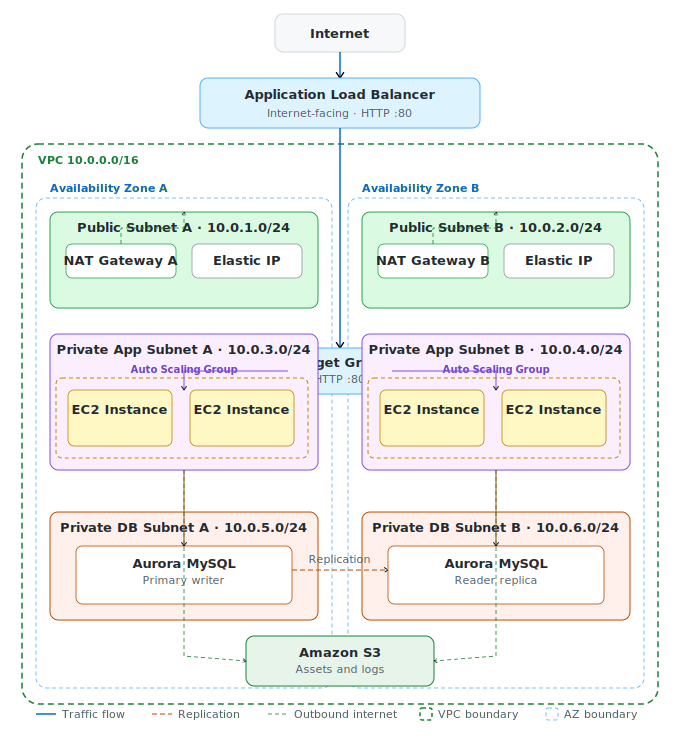

# Architecture

# Architecture Overview

The AWS Production Web Platform is a highly available three-tier web application environment deployed within AWS.

The platform is designed to demonstrate production-style cloud architecture patterns, including:

* Multi-AZ deployment
* Load-balanced application traffic
* Auto Scaling compute resources
* Managed database services
* Private network segmentation
* Infrastructure lifecycle automation

The environment is provisioned and managed using AWS CLI automation.

---

## Architecture Diagram



---

# Architecture Goals

The platform was designed with the following objectives:

* High availability
* Secure network segmentation
* Horizontal scalability
* Operational simplicity
* Infrastructure automation
* Cost awareness

---

# High-Level Architecture

The environment consists of three primary tiers:

```text
Presentation Tier
        |
        v
Application Tier
        |
        v
Data Tier
```

AWS services:

| Tier         | Service                   |
| ------------ | ------------------------- |
| Presentation | Application Load Balancer |
| Application  | EC2 Auto Scaling Group    |
| Data         | Aurora MySQL              |

---

# Component Architecture

```text
Internet
    |
    v
Application Load Balancer
    |
    v
Target Group
    |
    v
Auto Scaling Group
    |
    v
EC2 Application Instances
    |
    v
Aurora MySQL Cluster
```

---

# Core Components

## Application Load Balancer

Responsibilities:

* Public application entry point
* Traffic distribution
* Health monitoring
* High availability across Availability Zones

Benefits:

* Eliminates single-instance dependency
* Improves fault tolerance
* Supports horizontal scaling

---

## Auto Scaling Group

Responsibilities:

* Instance lifecycle management
* Capacity management
* Automatic instance replacement
* Multi-AZ deployment

Configuration:

```text
Minimum Capacity: 2
Desired Capacity: 2
Maximum Capacity: 4
```

Benefits:

* Improved availability
* Automatic recovery
* Scalable application layer

---

## EC2 Application Tier

Application servers process user requests and business logic.

Characteristics:

* Private deployment
* Managed by Auto Scaling
* No direct internet exposure
* Receives traffic only from the ALB

---

## Aurora MySQL

Aurora provides the relational database layer.

Responsibilities:

* Data persistence
* Managed database operations
* Backup management
* High availability support

Characteristics:

* Private deployment
* No public accessibility
* Restricted network access

---

# Traffic Flow

User requests follow this path:

```text
Internet
    |
    v
Application Load Balancer
    |
    v
Application Instance
    |
    v
Aurora Database
```

Response flow:

```text
Aurora Database
    |
    v
Application Instance
    |
    v
Application Load Balancer
    |
    v
User
```

---

# Availability Strategy

The environment is designed to reduce single points of failure.

Availability measures include:

* Multi-AZ deployment
* Load-balanced traffic distribution
* Auto Scaling instance replacement
* Managed database platform
* Redundant networking components

Benefits:

* Improved resiliency
* Fault isolation
* Reduced service interruption

---

# Security Model

The platform follows a layered security approach.

Security controls include:

* Private application subnets
* Private database subnets
* Security group isolation
* IAM roles for AWS access
* No public database exposure

Detailed security controls are documented in:

```text
docs/governance/security.md
```

---

# Network Architecture Reference

This document focuses on application architecture.

Detailed networking design is documented separately:

```text
docs/architecture/network-design.md
```

Topics include:

* VPC design
* CIDR planning
* Subnet strategy
* Route tables
* NAT Gateways
* Internet Gateway configuration

---

# Operational Lifecycle

Infrastructure lifecycle automation includes:

* Deployment automation
* Environment validation
* Operational runbooks
* Incident response procedures
* Automated environment cleanup

Supporting documentation:

```text
deployment/deployment-guide.md
operations/operational-runbook.md
operations/incident-scenarios.md
```

---

# Summary

The AWS Production Web Platform demonstrates a production-style three-tier architecture that emphasizes:

* Availability
* Security
* Scalability
* Automation
* Operational maintainability

The design intentionally mirrors common cloud architecture patterns used in enterprise AWS environments while remaining practical for a development and portfolio environment.